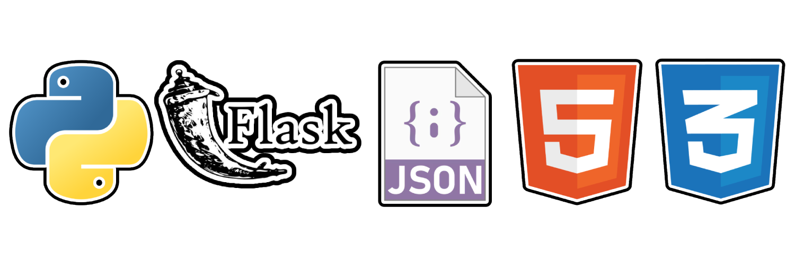

# Simulador de blockchain

Simulador de blockchain con python y flask, en donde se puede ver el funcionamiento de la cadena de bloques, tambien como la encriptacion, manejo de usuario, algoritmos AES, RSA, y manejo de HASH


## Screenshots
<div align="center">


</div>

## 🛠 Skills
python, flask, css, html, json
<p align="center">
  
</p>

## Deployment

Instalación de dependencias

```bash
  python install -r requeriments
```

Ejecución del servidor

```bash
  python server.py
```

